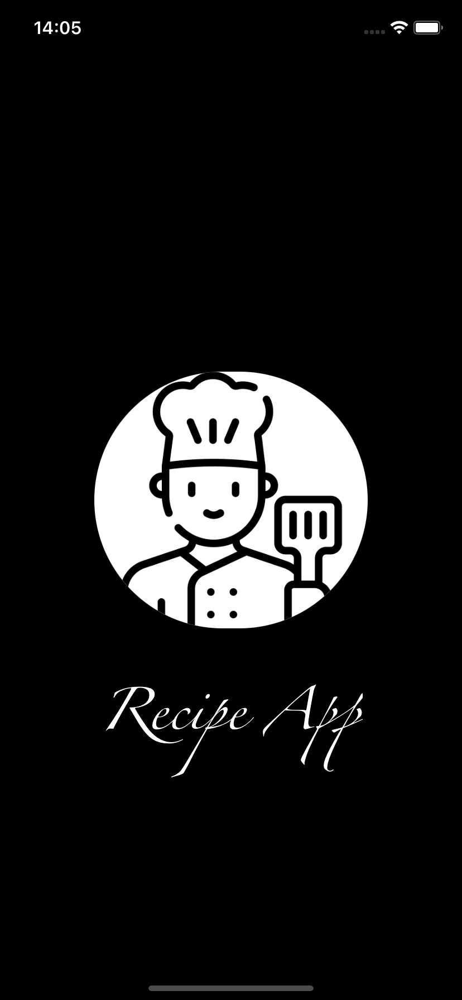
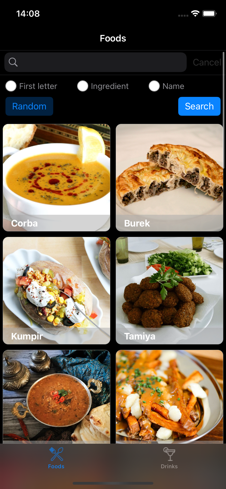
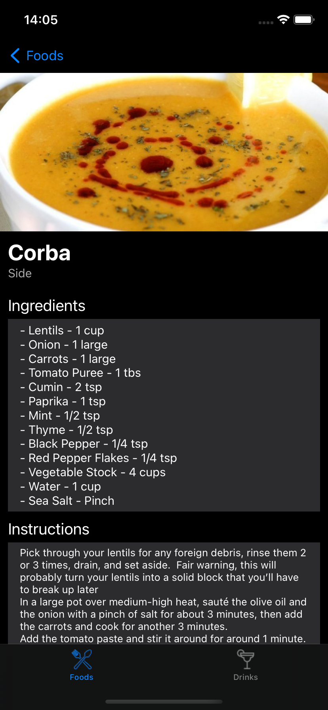
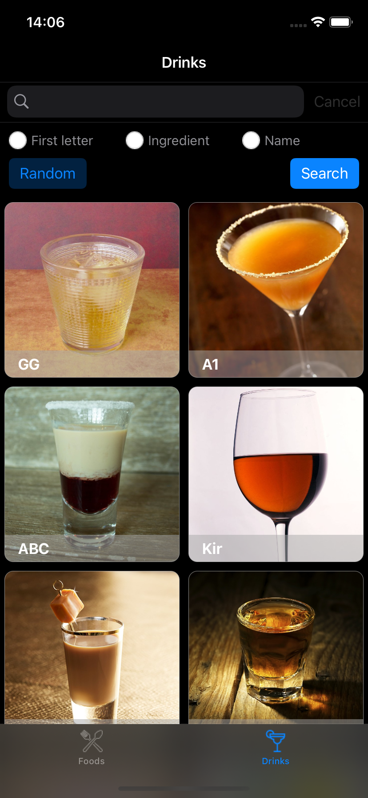
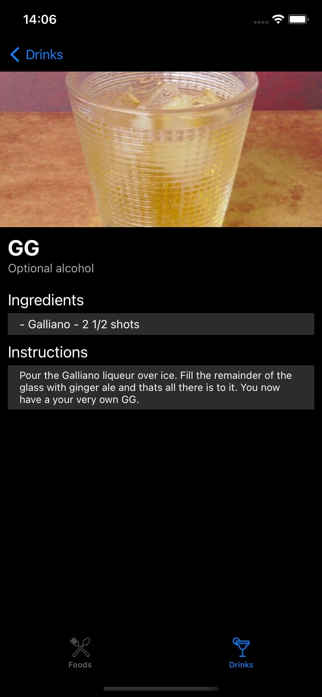
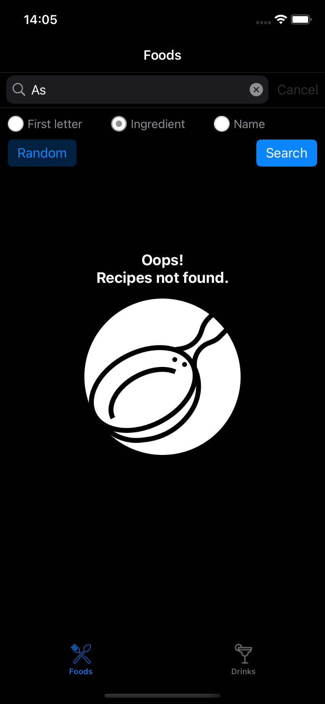
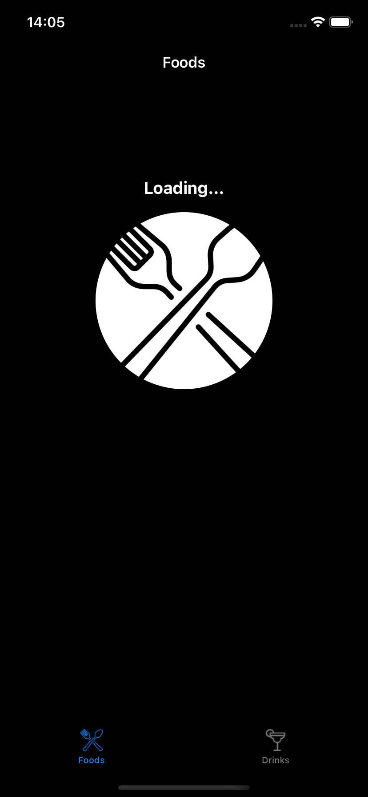

# Recipe App iOS - MVVM+C+S

## Features
- Search meals or drinks by:
  - Name
  - Ingredient
  - First letter
- Random meal or drink
- See meal or drink details

## APIs
- [TheMealDB API](https://www.themealdb.com/)
- [The CockTailDB API](https://www.thecocktaildb.com/api.php)
## Requirements 
 - XCode 13.1
 - CocoaPod 1.11.3

## Pods
- SwiftLint
- Alamofire
- SDWebImage
- Mocker
- SnapshotTesting

## Images

| |
|:---:|
| Launch screen |

||  |
|:---:| :---:|
| Meals | Meal details|

||  |
|:---:| :---:|
| Drinks | Drink details|

||  |
|:---:| :---:|
| Not found | Loading|

## Video preview

